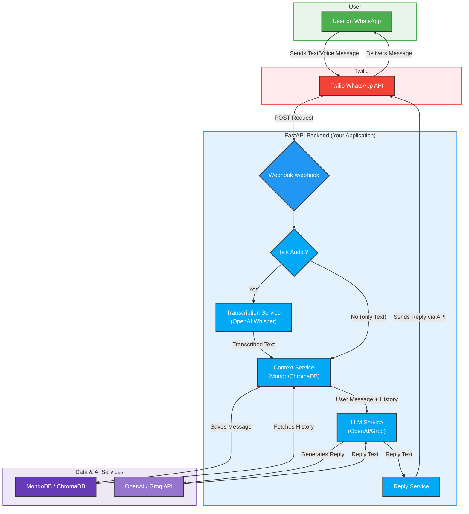

# BucksBunny WhatsApp Bot

BucksBunny is an intelligent, voice-enabled WhatsApp chatbot designed to enhance financial literacy, particularly for users in India. This bot provides guidance on a range of financial topics including savings, loans, and insurance. It leverages Large Language Models (LLMs) to deliver friendly and accessible advice.

## Features

* **Voice and Text Interaction**: Supports both voice notes and text messages for user input.
* **LLM Integration**: Seamlessly integrates with LLM providers like OpenAI and Groq to generate intelligent and context-aware responses.
* **Contextual Conversations**: Maintains conversation history to provide relevant and coherent replies. The bot can use MongoDB or a RAG-based approach with ChromaDB for context management.
* **Audio Transcription**: Capable of transcribing audio messages into text using OpenAI's Whisper model.
* **Extensible Framework**: The codebase is modular, making it easy to add new functionalities or integrate other services.
* **Deployment Ready**: Comes with a Dockerfile and a GitHub Actions workflow for easy deployment to Google Cloud Run.

[](https://youtu.be/L06bvfpWTT4)

## Tech Stack

* **Backend**: FastAPI
* **LLM Providers**: OpenAI, Groq
* **Database**: MongoDB, ChromaDB (for RAG)
* **Messaging**: Twilio WhatsApp API
* **Audio Transcription**: OpenAI Whisper
* **Deployment**: Docker, Google Cloud Run




## Installation and Setup

### Prerequisites

* Python 3.11
* Twilio Account
* ngrok for local development
* Credentials for an LLM provider (OpenAI or Groq)

### Local Development Setup

1.  **Clone the repository:**
    ```bash
    git clone <repository-url>
    cd whatsapp-llm-bot
    ```

2.  **Set up the environment variables:**
    * Copy the `.env.example` file to a new file named `.env`:
        ```bash
        cp .env.example .env
        ```
    * Open the `.env` file and add your credentials for Twilio, your chosen database, and LLM provider.

3.  **Install dependencies:**
    ```bash
    pip install -r requirements.txt
    ```

4.  **Run the application:**
    * On Windows, you can use the provided batch file to set up the virtual environment, install dependencies, start ngrok, and run the FastAPI server:
        ```bash
        run_local.bat
        ```
    * Alternatively, you can run the application manually:
        ```bash
        uvicorn app.main:app --reload
        ```

5.  **Configure Twilio Webhook:**
    * Once ngrok is running, it will provide a public URL.
    * Go to your Twilio console, navigate to your WhatsApp sandbox settings, and set the webhook URL for incoming messages to `https://<your-ngrok-url>/webhook`.

## Configuration

You can configure the application by setting the following environment variables in your `.env` file:

* `TWILIO_ACCOUNT_SID`: Your Twilio Account SID.
* `TWILIO_AUTH_TOKEN`: Your Twilio Auth Token.
* `TWILIO_PHONE_NUMBER`: Your Twilio WhatsApp number.
* `CONTEXT_BACKEND`: The backend for context management. Can be `mongo` or `rag`.
* `MONGO_HOST`, `MONGO_USER`, `MONGO_PASSWORD`, `MONGO_DB`, `MONGO_COLLECTION`: Your MongoDB connection details.
* `CONTEXT_LIMIT`: The number of previous messages to consider for context.
* `LLM_PROVIDER`: The LLM provider to use (`openai` or `groq`).
* `LLM_API_KEY`: Your API key for the selected LLM provider.
* `OPENAI_API_BASE`, `OPENAI_MODEL`: Configuration for OpenAI.
* `GROQ_API_BASE`, `GROQ_MODEL`: Configuration for Groq.
* `LLM_MAX_TOKENS`, `LLM_TEMPERATURE`: Parameters for the LLM.
* `SYSTEM_PROMPT`: The system prompt for the LLM.

## Usage

Once the application is running and the Twilio webhook is configured, you can start sending messages to your Twilio WhatsApp number. The bot will reply with intelligent, financially-focused advice.

## Deployment

This project includes a `Dockerfile` and a GitHub Actions workflow for easy deployment to Google Cloud Run.

### Docker

To build and run the Docker image locally:

1.  **Build the image:**
    ```bash
    docker build -t whatsapp-llm-bot .
    ```
2.  **Run the container:**
    ```bash
    docker run -p 8000:8000 -e ENV=production --env-file .env whatsapp-llm-bot
    ```

### Google Cloud Run

The `.github/workflows/deploy.yml` file contains a workflow to deploy the application to Google Cloud Run. To use it, you will need to set up the following secrets in your GitHub repository:

* `GCP_SA_KEY`: Your Google Cloud service account key.
* `GCP_PROJECT_ID`: Your Google Cloud project ID.
* `GCP_REGION`: The Google Cloud region where you want to deploy the application.

The workflow can be triggered manually from the Actions tab in your GitHub repository.


